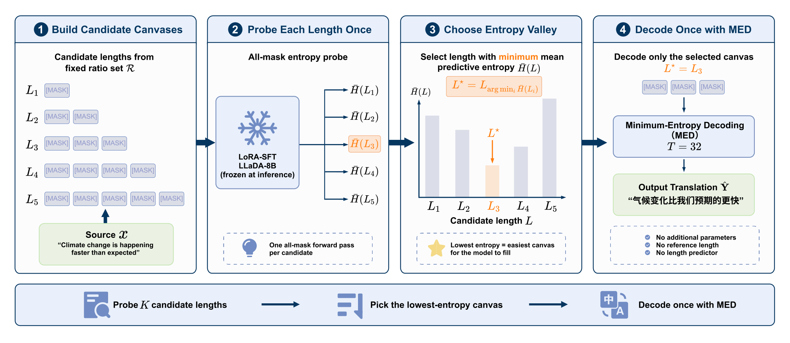
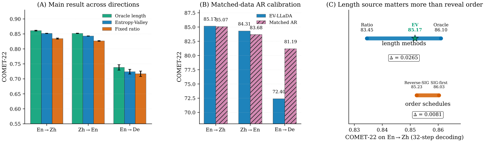
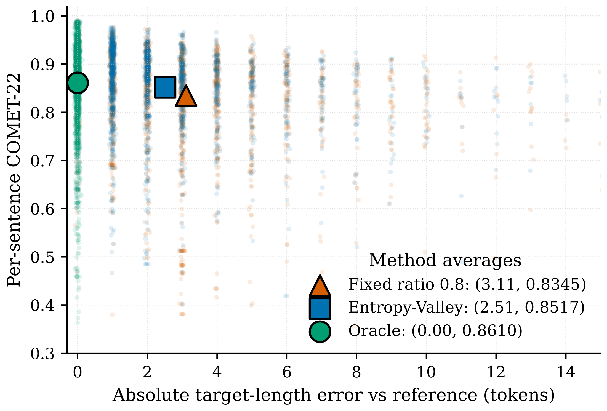
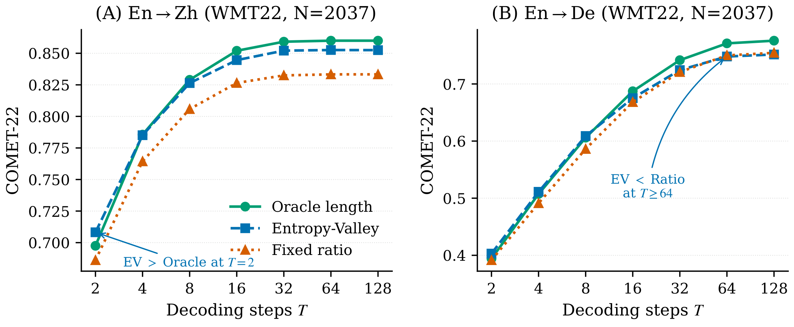

<h1 align="center"> <br>Length-Adaptive Decoding for Masked Diffusion Machine Translation</h1>

<div align="center">

[](https://arxiv.org/abs/2608.22274)
[](https://huggingface.co/collections/YanZhanPKU/entropy-valley)
[](https://huggingface.co/datasets/YanZhanPKU/Entropy-Valley-Datasets)
[](https://opensource.org/licenses/MIT)
[](https://www.python.org/downloads/)
[](https://2026.emnlp.org/)

</div>

<h5 align="center">If you like our project, please give us a star ⭐ on GitHub for the latest update.</h5>

<div align="center">
  
</div>

## 📣 Latest News

- **[2026-08]**: 📄 The camera-ready paper is on **[arXiv:2608.22274](https://arxiv.org/abs/2608.22274)**.
- **[2026-08]**: 🎉 Our paper has been accepted to the **EMNLP 2026 Main Conference**!
- **[2026-08]**: 🚀 Code, LoRA adapters, and the full data pipeline are open-sourced — [🤗 models & dataset](https://huggingface.co/collections/YanZhanPKU/entropy-valley).

## 💡 Overview

Masked diffusion language models (LLaDA, Dream, DiffuLLaMA, …) decode by **filling a fixed-size canvas**. Unlike an autoregressive decoder, which generates until it emits EOS, a masked diffusion decoder must be told **how many target slots to fill before denoising begins**. Get it wrong and the damage is done before a single token is revealed: a short canvas silently drops source content, an overlong canvas invites repetition and hallucination.

Existing work on masked diffusion decoding mostly asks **which positions to unmask first**. This paper asks the prior question — **which canvas to unmask them on**.

**Entropy-Valley (EV)** is a training-free answer. For a source sentence, EV builds a small set of candidate canvas lengths from five fixed ratios, probes each distinct length with a *single* all-mask forward pass, and picks the canvas with the **lowest mean predictive entropy** — the *entropy valley*, i.e. the canvas the frozen backbone is most prepared to fill:

$$L^{\star} = \arg\min_{L \in \mathcal{C}(\mathbf{x})} \bar{H}(L), \qquad \bar{H}(L) = \frac{1}{L-1}\sum_{i=1}^{L-1} H\big(p_\theta(y_i \mid \mathbf{x}, \texttt{[MASK]}^L)\big)$$

$$\mathcal{C}(\mathbf{x}) = \\{\max\\{1, \lfloor r|\mathbf{x}|\rfloor\\} + 1 \ :\ r \in \mathcal{R}\\}$$

The trailing `+1` reserves the slot designated for EOS, and that slot is **excluded** from the entropy average — it is near-deterministic and would otherwise dominate the score across canvases of different length.

EV then decodes the selected canvas with the *same* minimum-entropy decoding (MED) schedule as the baseline. **No extra parameters, no length predictor, and no use of the current sentence's reference length.** The probes cost under 16% extra forward passes at the default 32-step budget, and proportionally less as the budget grows.

### ✨ The Entropy-Valley Framework



**Key features:**

- **Canvas choice dominates the decoding decisions we evaluated.** In a controlled En→Zh comparison with the reference length held fixed, the EV−Ratio difference is larger than the full span across the tested reveal orders. That said, **poor reveal orders still hurt** — strict left-to-right and random order both score clearly below MED.
- **Training-free, backbone-internal signal.** The score comes from the same frozen model that will fill the canvas, so no auxiliary length head, alignment model, or calibration data is needed.
- **Not reference-length matching.** EV stays far from the oracle in length error yet recovers most of the oracle's COMET gain. It selects a *denoising-friendly* canvas, not a human reference length.
- **Coverage, not inflation.** EV preserves source-side placeholders and numbers that a short canvas silently drops — the failures are literal content losses, and the fix is picking the right canvas rather than a longer one.

### 📊 Main Results



We validate the length-selection finding across:

- **Three directions on WMT22.** With the backbone, training data and reveal schedule held fixed, replacing a fixed corpus ratio with EV closes **64.9% / 65.3% / 33.0%** of the COMET-22 gap to a reference-length oracle on En→Zh / Zh→En / En→De.
- **Three masked-diffusion backbones.** Repeating the protocol on LLaDA-8B-Base, Dream-v0-Base-7B and DiffuLLaMA-7B puts EV above the fixed-ratio baseline in every backbone × direction cell, though how much of the oracle gap it closes varies with the model family.
- **A matched-data autoregressive baseline.** Trained on the same data under the same budget, LLaMA-3-8B + LoRA-SFT ties EV-LLaDA on En→Zh and trails it on Zh→En. En→De is the honest boundary — the AR system sits above even the LLaDA length oracle there, so that shortfall is not a canvas-selection error.
- **Direct diffusion length baselines.** EV is ahead of DAEDAL in both En↔Zh directions and ahead of CAL on En→Zh, while issuing fewer model calls and allocating fewer canvas slots than CAL and running faster than both. On Zh→En EV and CAL are comparable.
- **Bilingual expert evaluation.** Three professional translators rated 100 stratified sentences per direction with per-row system blinding. The gain shows up as **adequacy**, not fluency — exactly what a length-selection account predicts.
- **A direction with no English on either side.** De→Fr transfers unchanged from a WMT19 held-out set to FLORES devtest, with EV above the ratio baseline in every setting.

## 🔧 Installation

```bash
git clone https://github.com/Entropy-Valley/Entropy-Valley.git
cd Entropy-Valley

conda create -n ladit python=3.10 -y
conda activate ladit
pip install -e .
```

`unbabel-comet` will download `Unbabel/wmt22-comet-da` on first use. Training was run on 8×H20-96GB GPUs; a single 80GB-class GPU is enough for decoding and evaluation.

## 📦 Models & Data

### Released LoRA adapters

Each adapter turns `GSAI-ML/LLaDA-8B-Base` into a masked-diffusion MT system for one direction. **The adapters do not contain Entropy-Valley** — EV is a decoding-time procedure implemented in `ladit/decoding/length_adaptive.py`. The same adapter serves all three length methods (oracle / ratio / EV); only the canvas length supplied to the decoder changes.

| Direction | Adapter | Base model |
|---|---|---|
| En → Zh | [🤗 Entropy-Valley-LLaDA-8B-En2Zh](https://huggingface.co/YanZhanPKU/Entropy-Valley-LLaDA-8B-En2Zh) | [GSAI-ML/LLaDA-8B-Base](https://huggingface.co/GSAI-ML/LLaDA-8B-Base) |
| Zh → En | [🤗 Entropy-Valley-LLaDA-8B-Zh2En](https://huggingface.co/YanZhanPKU/Entropy-Valley-LLaDA-8B-Zh2En) | [GSAI-ML/LLaDA-8B-Base](https://huggingface.co/GSAI-ML/LLaDA-8B-Base) |
| En → De | [🤗 Entropy-Valley-LLaDA-8B-En2De](https://huggingface.co/YanZhanPKU/Entropy-Valley-LLaDA-8B-En2De) | [GSAI-ML/LLaDA-8B-Base](https://huggingface.co/GSAI-ML/LLaDA-8B-Base) |

LoRA `r=64`, `α=128`, dropout `0.05`, targeting seven modules per block (`q/k/v/o_proj` + `ff_proj/up_proj/ff_out`), ≈157M trainable parameters (1.95% of the backbone).

### EV candidate grids

| Direction | WMT19 median ratio (reference scale) | Deployed grid $\mathcal{R}$ | Ratio baseline |
|---|---|---|---|
| En→Zh | 0.80 | {0.70, 0.75, 0.80, 0.85, 0.90} | 0.8 |
| Zh→En | 1.24 | {1.00, 1.10, 1.20, 1.30, 1.40} | 1.2 |
| En→De | 1.48 | {1.50, 1.60, 1.70, 1.80, 1.90} | 1.8 |

The WMT19 training-corpus medians provide a **reference scale**; the compact grids reported above were **informed by diagnostic range comparisons on WMT22 subsets** (Appendix C.1 of the paper). Once chosen, a grid is fixed and used for every sentence and every decoding method in that direction. At inference, EV never uses the current sentence's reference length or a separately trained length predictor.

### Datasets

All JSONL files the code reads are published at [🤗 **Entropy-Valley-Datasets**](https://huggingface.co/datasets/YanZhanPKU/Entropy-Valley-Datasets):

```bash
huggingface-cli download YanZhanPKU/Entropy-Valley-Datasets --repo-type dataset --local-dir ./data
```

| File | Rows | Content |
|---|---|---|
| `enzh_train.jsonl` / `enzh_dev.jsonl` | 200,000 / 2,000 | WMT19 zh-en parallel pairs (serves **both** En→Zh and Zh→En) |
| `ende_train.jsonl` / `ende_dev.jsonl` | 200,000 / 2,000 | WMT19 de-en parallel pairs |
| `wmt22_enzh_test.jsonl` | 2,037 | Official WMT22 News test set (En↔Zh) |
| `wmt22_ende_test.jsonl` | 2,037 | Official WMT22 News test set (En→De) |
| `challenge_sets/*.jsonl` | 14–400 | Coverage / numbers / dates / named-entity / enumeration / fertility-mismatch subsets |

These are **derived subsets** of the public WMT benchmarks, released for reproducibility under the original WMT research terms. To rebuild them from scratch instead:

```bash
python -m ladit.data.prepare_mt_data      --output_dir data --num_train 200000 --seed 42
python -m ladit.data.prepare_mt_data_ende --output_dir data --num_train 200000 --seed 42
python -m ladit.data.build_challenge_sets --input data/wmt22_enzh_test.jsonl --outdir data/challenge_sets --max_per_category 200
```

### Backbones for the cross-backbone check

| Backbone | HuggingFace path | Notes |
|---|---|---|
| LLaDA-8B-Base | [GSAI-ML/LLaDA-8B-Base](https://huggingface.co/GSAI-ML/LLaDA-8B-Base) | Default; from-scratch masked pretraining |
| Dream-v0-Base-7B | [Dream-org/Dream-v0-Base-7B](https://huggingface.co/Dream-org/Dream-v0-Base-7B) | Qwen2.5-7B init, masked-diffusion CPT |
| DiffuLLaMA-7B | [diffusionfamily/diffullama](https://huggingface.co/diffusionfamily/diffullama) | Llama-2-7B init, MDLM absorbing-diffusion CPT |

All three load through the unified `ladit/model/backbone.py`. Note that **Dream-v0-*Instruct*-7B is not usable** under this fixed-canvas MED protocol — its chat-aligned EOS at the canvas tail collapses outputs to the empty string regardless of the length choice (paper Appendix E.2).

## 🚀 Quick Start

### Entropy-Valley on a single sentence

```python
import torch
from transformers import AutoConfig, AutoModelForCausalLM, AutoTokenizer
from peft import PeftModel

from ladit.data.mt_dataset import set_lang_pair
from ladit.decoding.length_adaptive import entropy_valley_probe, set_mask_token_id as set_ev_mask
from ladit.decoding.translate import translate_single, set_mask_token_id as set_dec_mask

BASE, ADAPTER = "GSAI-ML/LLaDA-8B-Base", "YanZhanPKU/Entropy-Valley-LLaDA-8B-En2Zh"

tokenizer = AutoTokenizer.from_pretrained(BASE, trust_remote_code=True)
model = AutoModelForCausalLM.from_pretrained(BASE, trust_remote_code=True,
                                             torch_dtype=torch.bfloat16).to("cuda")
model = PeftModel.from_pretrained(model, ADAPTER).merge_and_unload().eval()

mask_tid = getattr(AutoConfig.from_pretrained(BASE, trust_remote_code=True), "mask_token_id", 126336)
set_ev_mask(mask_tid); set_dec_mask(mask_tid)
set_lang_pair("en-zh")                      # selects the prompt template + data keys

src = "Under #PRS_ORG#, tap Sign out."
n_src = len(tokenizer.encode(src, add_special_tokens=False))
# max{1, floor(r*|x|)} + 1 — the +1 reserves the designated EOS slot.
# Duplicate integer lengths collapse, so five ratios can yield fewer than five probes.
candidates = sorted({max(1, int(n_src * r)) + 1 for r in (0.70, 0.75, 0.80, 0.85, 0.90)})

probe  = entropy_valley_probe(model, tokenizer, src, candidates)   # <= 5 forward passes
L_star = probe["best_length"]                                      # the entropy valley

out = translate_single(model, tokenizer, src, target_length=L_star,
                       num_steps=32, schedule_name="med")
print(L_star, out["translation"])
```

`probe["results"]` holds the per-candidate `mean_entropy_nolast` — the entropy curve (excluding the EOS slot) whose minimum EV selects. For batched decoding use `entropy_valley_batch(...)`, which also returns the `selected_ratio` for each sentence.

### Full pipeline: train → decode → score

One launcher covers all three directions. It LoRA-fine-tunes the backbone, decodes WMT22 under **all three length methods** (oracle / fixed ratio / Entropy-Valley), and scores sacreBLEU + COMET-22:

```bash
bash scripts/train_and_eval.sh configs/enzh.yaml 42   # English → Chinese
bash scripts/train_and_eval.sh configs/zhen.yaml 42   # Chinese → English
bash scripts/train_and_eval.sh configs/ende.yaml 42   # English → German
```

Point `model.path` in each `configs/*.yaml` at your local LLaDA-8B-Base copy first. Training takes ≈6 GPU-hours per (direction, run) cell on 8×H20-96GB; the paper's full experimental grid is ≈420 H20 GPU-hours. Results land in `eval_results/ladit_{enzh,zhen,ende}_seed{SEED}/`.

### Decoding only (skip training, use the released adapter)

```bash
python scripts/decode_eval.py \
    --model_path /path/to/LLaDA-8B-Base \
    --lora_path  YanZhanPKU/Entropy-Valley-LLaDA-8B-En2Zh \
    --input_file data/wmt22_enzh_test.jsonl \
    --output_dir eval_results/enzh_ev \
    --num_examples 2037 --num_steps 32 --schedule med \
    --methods "oracle,ratio_0.8,entropy_valley" \
    --candidate_ratios "0.70,0.75,0.80,0.85,0.90" \
    --lang_pair en-zh --device cuda

python -m ladit.evaluation.evaluate \
    --translations_file eval_results/enzh_ev/translations_entropy_valley.json \
    --output_file       eval_results/enzh_ev/metrics_entropy_valley.json \
    --comet_model Unbabel/wmt22-comet-da
```

### Matched-data AR baseline (LLaMA-3-8B)

```bash
bash scripts/run_ar_baseline.sh en-zh 42 ar_enzh_seed42     # LoRA SFT
bash scripts/decode_ar_eval.sh  ar_enzh_seed42 en-zh 42 ar_enzh_seed42   # decode + score
```

### Cross-backbone cells

```bash
export MODELS_DIR=/path/to/your/models     # one dir holding the three backbones
export OUTPUT_BASE=$(pwd)/runs
bash scripts/run_backbone_validation.sh dream      42  enzh
bash scripts/run_backbone_validation.sh diffullama 42  ende

python scripts/compute_crossbb_comet.py --eval_dir eval_results --data_dir data \
    --out eval_results/cross_backbone_comet.json
```

## 🗂️ Repository Layout

| Path | Role |
|---|---|
| `ladit/decoding/length_adaptive.py` | **Entropy-Valley length selector (core method)** — also holds the EOS-probe, partial-unmask, and multi-candidate baselines |
| `ladit/decoding/translate.py` | Iterative MED decoder over a fixed canvas |
| `ladit/decoding/schedules.py` | Reveal-order schedules (MED, random, L2R, SIG hybrids) |
| `ladit/decoding/sig.py` | Source-Information-Guided order signals used in the order-vs-length diagnostic |
| `ladit/model/backbone.py` | Unified loader for LLaDA / Dream / DiffuLLaMA (mask token id, logit shift, attention mask) |
| `ladit/training/train.py` | Masked-diffusion LoRA SFT loop |
| `ladit/training/train_ar.py` | Matched AR (next-token) LoRA SFT loop for LLaMA-3-8B |
| `ladit/data/mt_dataset.py` | MT dataset + prompt templates |
| `ladit/data/prepare_mt_data*.py` | WMT19/WMT22 JSONL construction |
| `ladit/data/build_challenge_sets.py` | Coverage / numbers / dates / NE / enumeration subsets |
| `ladit/evaluation/evaluate.py` | sacreBLEU + COMET-22 (writes `comet22_per_sentence`) |
| `ladit/evaluation/sig_analysis.py` | Order-vs-length analysis for the appendix |
| `scripts/` | End-to-end launchers for every table in the paper |
| `human_eval/` | Annotation guidelines (EN + ZH), blank form template, blinding protocol |

## 🔬 Reproducing the Paper

**Per-sentence scores.** `evaluate.py` writes a `comet22_per_sentence` array into every `metrics_${METHOD}.json`; the paper's paired tests run on those arrays. (`ladit/evaluation/significance_test.py` is an earlier helper targeting an older on-disk schema — kept only as a reference for the recipe.)

**Selected canvas lengths.** `length_adaptive.py` writes the chosen ratio $L^{\star}/|\mathbf{x}|$ per example into the decoding JSON as `selected_ratio` — this is what the length/quality dissociation analysis consumes.

<div align="center">
  
  
</div>

**En→De protocol note.** `configs/ende.yaml` ships `ev_candidate_ratios: "1.50,1.60,1.70,1.80,1.90"`, the protocol-aligned grid behind the reported numbers. Earlier pilot runs used a narrower grid — do **not** mix eval artifacts from the two grids when computing gap closure.

**Human evaluation.** `human_eval/` contains the bucket-stratification design (25 EV-best / 25 Ratio-best / 25 tied / 25 random), the per-row Bernoulli(0.5) blinding protocol, the blank 100-row CSV form, and direction-specific guidelines in English and Chinese. The three experts' raw individual ratings are **not** released for privacy reasons; the paper reports aggregated statistics only.

## ⚠️ Known Limitations

- **The candidate grid bounds what EV can pick.** With $\mathcal{R} = \{0.70,\dots,0.90\}$ on En→Zh, EV cannot choose a canvas below $0.70|\mathbf{x}|$, so sentences needing stronger compression fall outside the window. The paper's failure analysis shows the dominant error is nevertheless a *within-grid* wrong pick, which points at the entropy aggregation rule rather than grid width.
- **Grid-selection transfer is open.** The reported grids are direction-specific and were informed by WMT22 diagnostic-subset comparisons. The De→Fr transfer used one fixed grid unchanged, but transferring the *procedure* for choosing a grid remains an open question.
- **Reveal order still matters.** The controlled comparison says canvas choice produced the larger variation among the decisions we evaluated — not that reveal order is irrelevant. Strict left-to-right and random order both score clearly below MED.
- **En→De is a boundary case.** The mean over three runs is positive, but sentence-level evidence is weaker, and at $T{\ge}64$ the fixed ratio slightly overtakes EV.
- **Backbone-bounded.** Gains survive on Dream-Base and DiffuLLaMA, but absolute scores and closures move with tokenizer and pretraining. Broader claims need more backbones and language pairs.
- **Human evaluation covers En↔Zh only.**

## 📄 Citation

```bibtex
@inproceedings{zhan2026lengthadaptive,
  title         = {Length-Adaptive Decoding for Masked Diffusion Machine Translation},
  author        = {Zhan, Yan and Hou, Mengkai and Zhang, Wanting and Gao, Zhijun},
  booktitle     = {Proceedings of the 2026 Conference on Empirical Methods in Natural Language Processing (EMNLP)},
  year          = {2026},
  eprint        = {2608.22274},
  archivePrefix = {arXiv},
  primaryClass  = {cs.CL},
  url           = {https://arxiv.org/abs/2608.22274}
}
```

## 🙏 Acknowledgements

This work builds on [LLaDA](https://huggingface.co/GSAI-ML/LLaDA-8B-Base), [Dream](https://huggingface.co/Dream-org/Dream-v0-Base-7B), [DiffuLLaMA](https://huggingface.co/diffusionfamily/diffullama), [PEFT](https://github.com/huggingface/peft), [COMET](https://github.com/Unbabel/COMET), and [sacreBLEU](https://github.com/mjpost/sacrebleu). We thank the WMT organisers for the public benchmarks, BYD for providing computing resources, and the professional translators who supported the human evaluation.

## 📜 License

Code in this repository is released under the [MIT License](./LICENSE). The released LoRA adapters inherit the licence of the `GSAI-ML/LLaDA-8B-Base` backbone; the datasets are derived from public WMT benchmarks and remain subject to the original WMT research terms.

## 📮 Contact

Questions and issues are welcome via [GitHub Issues](https://github.com/Entropy-Valley/Entropy-Valley/issues), or contact `gaozhijun@pku.edu.cn`.

